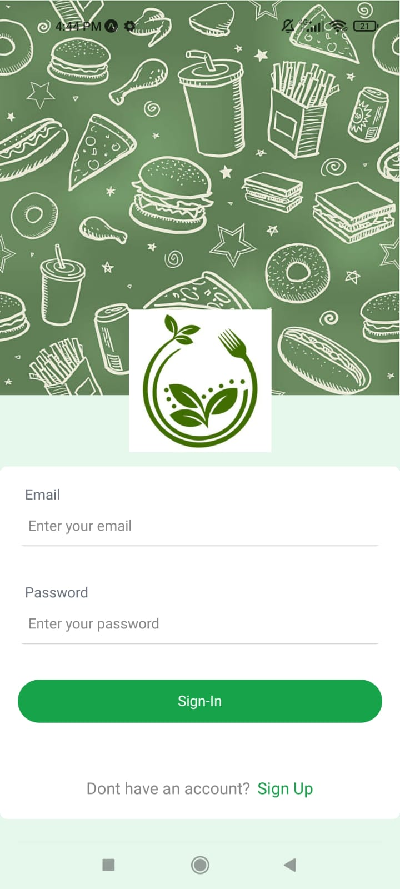
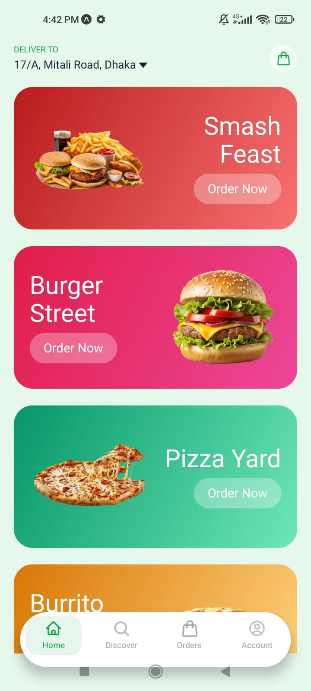
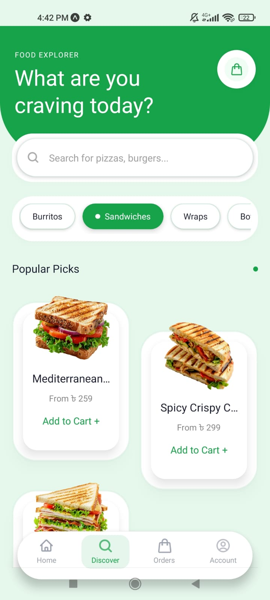
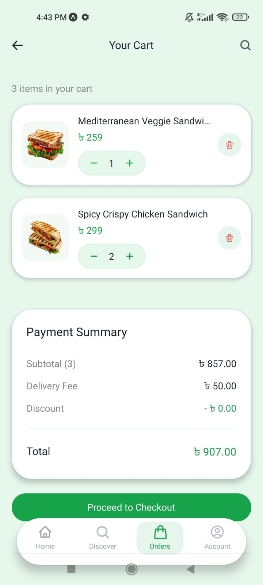

# 🍔 Food Delivery App – React Native Food Delivery

A modern React Native & Expo food delivery app with real-time location, map-based delivery, discoverable restaurants, cart management, and smooth user experience. Designed to mimic a real-world food delivery app.

---

## 📱 Features

### **1. Sign-In & Authentication**

* Secure login using **Appwrite** backend.
* Users can register and log in quickly.
* Smooth UX with loading indicators.

**Screenshot:**

---

### **2. Home Screen**

* Displays user’s **current location** and popular dishes.
* Quick access to categories and promotions.
* Personalized greeting.

**Screenshot:**

---

### **3. Map & Delivery Location**

* Set delivery location manually or via search.
* Live map pin with draggable marker.
* Reverse geocoding shows exact address.
* Fully functional using **Expo Location** and **OpenStreetMap API**.

**Screenshot:**

---

### **4. Discover & Browse**

* Explore restaurants and menu items.
* Search functionality integrated with live suggestions.
* Clean, intuitive card layout for menu items.

**Screenshot:**

---

### **5. Cart & Checkout**

* Add/remove items with live cart updates.
* See total prices and checkout easily.
* Mock checkout flow (can integrate payment gateways later).

**Screenshot:**

---

## 🛠 Tech Stack

* **Frontend:** React Native + Expo
* **State Management:** Zustand / React Hooks
* **Maps:** react-native-maps + OpenStreetMap API
* **Location Services:** Expo Location
* **Backend:** Appwrite (Authentication + User Data)
* **Styling:** TailwindCSS + React Native styling conventions

---
